Inconsolata LGC
===============

Inconsolata is one of the most suitable font for programmers created by Raph
Levien. Since the original Inconsolata does not contain Cyrillic alphabet,
it was slightly inconvenient for not a few programmers from Russia.

Inconsolata LGC is a modified version of Inconsolata with added the Cyrillic
alphabet which directly descends from Inconsolata Hellenic supporting modern
Greek.

Inconsolata LGC changes
-----------------------
* Cyrillic glyphs and additional symbols added.
* Italic and Bold font added.

### Changes inherited from Inconsolata Hellenic
* Greek glyphs.

### Changes inherited from Inconsolata-dz:
* Straight quotation marks.

Regional forms
--------------
Inconsolata LGC supports OpenType `locl` feature to display Polish,
Romanian, Bulgarian, Macedonian, and Serbian specific variant. TTC version
is intended for use in apps which do not support `locl` feature.

### Polish _kreska_ ###
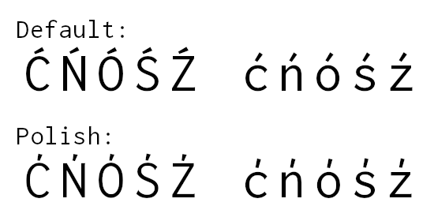

Polish _kreska_ looks steeper than acute accent.

For legacy apps, use **Inconsolata LGC Polish** in the TTC.

### Romanian comma accent ###
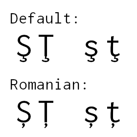

Romanian alphabet has S and T with comma below, not with cedilla. The `locl`
feature for Romanian is included for compatibility: using codepoints in
Latin Extended B is recommended.

In addition, D with cedilla will be replaced with D with comma below since it
was used for pre-1904 spelling. It is now spelt with Z.

For legacy apps, use **Inconsolata LGC Romanian** in the TTC.

### Bulgarian variant ###
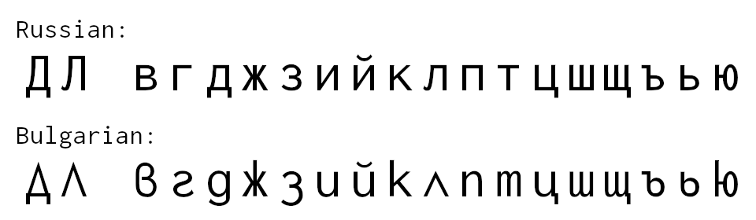

Bulgarian Cyrillic alphabet overall looks more round than Russian one. Some
of them look like italic forms made upright. _El_ looks like uppercase lambda
and uppercase _De_ like delta with descender. Lowercase _ve_, _zhe_, _ka_,
and _yu_ have ascenders and _ze_ has descender.

For legacy apps, use **Inconsolata LGC Bulgarian** in the TTC.

### Serbian and Macedonian italic ###

Serbian and Macedonian Cyrillic alphabet has italic forms different from
Russian one. Serbian and Macedonian take delta-like _be_ while Russian takes
6-like one. In Serbian italic forms, _ge_, _pe_, and _te_ look like i, u, and
upside-down m, all three with a top bar while Russian ones looks like
mirror-image s, lowercase n and m.
Lowercase _de_ looks like g. In some fonts, Russian one looks like round d,
but Inconsolata LGC is not designed so.
Delta-like _be_ also applies in Roman (non-italic) fonts.

For legacy apps, use **Inconsolata LGC Yugoslav** in the TTC.

### Livonian comma accent ###
Livonian alphabet has D and T with comma below, not with cedilla. However,
since there is not an OpenType language system tag, `locl` feature is not
available for Livonian.

Use **Inconsolata LGC Livonian** in the TTC.

### Sami _Eng_ ###
In Sami languages, uppercase Eng should use that derived from uppercase N.
Default glyph in this font is that from lowercase n.
This feature is not activated for Kildin Sami since it is usually written
in Cyrillic.

For legacy apps, use **Inconsolata LGC Sami** in the TTC.

### Pinyin variants ###
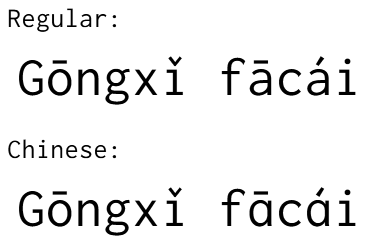

In Chinese fonts, acute accent (2nd tone or _yangping_) usually looks
pointing upwards, unlike that of Western languages which is pointing
downwards.
Also, single-story lowercase _a_ is used when a tone mark is above it.

However since Inconsolata is not a Chinese font, _Hanzi_ is not included.
The OpenType language system tag is `ZHP ` (note the trailing space).

For legacy apps, use **Inconsolata LGC Pinyin** in the TTC.

### Ewe f-hook ###
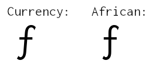

U+0192 is both used as a letter in Ewe and as florin sign. For the latter
usage, it is always in italic and this font already includes U+0192 as florin
sign like many other fonts. On the other hand, Roman (non-italic) version of
f-hook is required for Ewe text.

For legacy apps, use **Inconsolata LGC African** in the TTC.

### Chuvash _śă_ ###
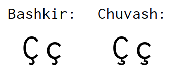

U+04AA and U+04AB are used in several languages in Russia; in Chuvash, unlike
Bashkir, looks like C with cedilla.

For legacy apps, use **Inconsolata LGC Chuvash** in the TTC.

### Dutch accented IJ ###
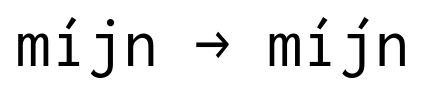

In Dutch, acute accent is used to mark stress like _vóórkomen_ vs _voorkómen_,
or _één_ vs _een_. When _ij_ is stressed, both _i_ and _j_ should be accented.

This Dutch and Flemish language-specific feature works for a _J_ preceded by
an _I_, or a _j_ preceded by an _i_.

Miscellaneous variants
----------------------

### `onum`: old style numerals ###
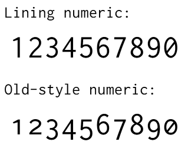

Old style numerals are “lowercase” of numerals: 0, 1, and 2 are of x-height,
6 and 8 have ascenders, and the others have descenders. They are also known
as text figures.
On the other hand, lining (or titling) numerals are “uppercase” to which
this font defaults.

### `cv01`: variants of zero ###
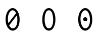

The zero without slash was included but not used in the original Inconsolata.
Feature tag `zero` is inappropriate here because zero is slashed by default
in this font. Some programming fonts include dotted zero in lieu of slashed
zero.

1. plain zero (without slash)
2. dotted zero
3. zero with long slash

### `cv02`: _r_ with serif ###
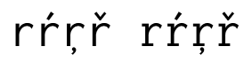

The glyph was included but not used in the original Inconsolata.

### `cv03`: variants of _Eng_ ###
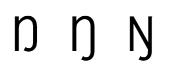

Uppercase _Eng_ can have glyphs derived from either upper- or lowercase
of N.

1. _Eng_ with descender derived from enlarged lowercase n
2. _Eng_ with descender derived from uppercase N

### `cv04`: alternative dollar signs ###
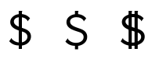

Dollar sign has glyph variant with either one or two vertical bars. There is
another variant with a vertical bar without the middle part found in some
console fonts. In Brazil and Cape Verde, the double-stroke variant is
preferred for the local currencies.

1. dollar sign without the middle part of the vertical bar
2. dollar sign with two vertical bars, also known as _cifrão_ in Portuguese

### `cv05`: variants of _Ezh_ ###
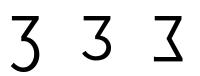

Uppercase _Ezh_ has reversed-Sigma variant.

1. _Ezh_ without descender
2. reversed Sigma

### `cv06`: text form triangles ###
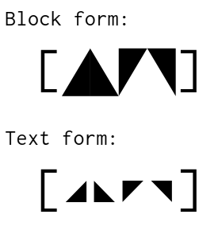

Triangles at U+25E2 to U+25E5 used to be implemented of the same size with
other geometric shapes like circles and squares. As a result of that
additional mosaic characters are added at version 1.9, the triangles are now
rendered of the size of block elements. Conventional glyphs can be accessed
through the OpenType feature.

### `cv07`: variants of _El with hook_ ###
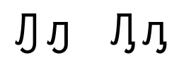

_El with hook_ has two variant forms.

### `cv08`: variants of uppercase _Qa_ ###
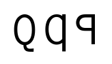

Uppercase _Qa_ usually looks identical to Latin letter _Q_, but there also
some variant forms.

1. enlarged lowercase
2. reversed _P_

### `cv09`: _Che_ with hook ###
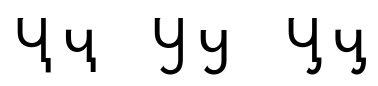

_Che with hook_ is an allograph of _che with descender_ (U+04B6 and U+04B7)
and has two variants.

1. variant with lengthened stem
2. variant with attached hook

### `cv10`: _Ge_ with hook ###
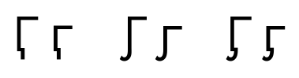

_Ge with hook_ is an allograph of _ge with descender_ (U+04F6 and U+04F7) and
has two variants.

1. variant with lengthened stem
2. variant with attached hook

### `cv11`: _Ge_ with stroke and descender ###
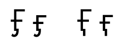

_Ge with stroke and descender_ is a variant of _ge with stroke and hook_
(U+04FA and U+04FB).

### `cv12`: Alternative glyphs for control pictures ###
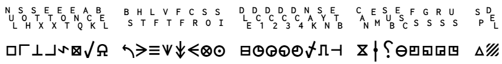

Symbol notations for U+2400 to U+2421 in Control Pictures.

### `ss01`: German alternative umlaut ###
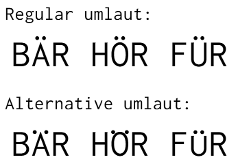

Lowered position of umlaut to fit to ascenders.

### `ss02`: Polytonic Greek alternative circumflex ###
Greek circumflex (_perispomeni_) looks like either tilde or inverted breve.
Inconsolata defaults to inverted breve form; tilde form is used when `ss02`
is activated.

Variable font
-------------
As of version 1.5.1, variable font package is available along with
conventional single-master font package. The variable font has 2 axes: weight
and italicization. The former is interpolatable but the latter is not.

Note that weight less than 400 (regular) and greater than 700 (bold) are of
extrapolation: expect issues such as stroke width disharmony or unexpected
bump for such weight.

### Known issues on the variable font ###
- For KDE font manager on Linux:
  - Extra-light italic font is recognized as of separate font family
    _Inconsolata LGC Italic_.
  - A subfamily with empty name is listed. This occurs other variable fonts
    too.

Build-time dependencies
-----------------------
* [FontForge](https://fontforge.org/) with both Python and classic scripting
  feature enabled
* For TTC, also:
  * [Adobe Font Development Kit for OpenType][1] to build TTC
* For variable font, also:
  * [fonttools](https://github.com/fonttools/fonttools)
  * [fontmake](https://github.com/googlefonts/fontmake)

[1]: https://github.com/adobe-type-tools/afdko

License
-------
Inconsolata LGC is licensed under [SIL OFL](LICENSE).
